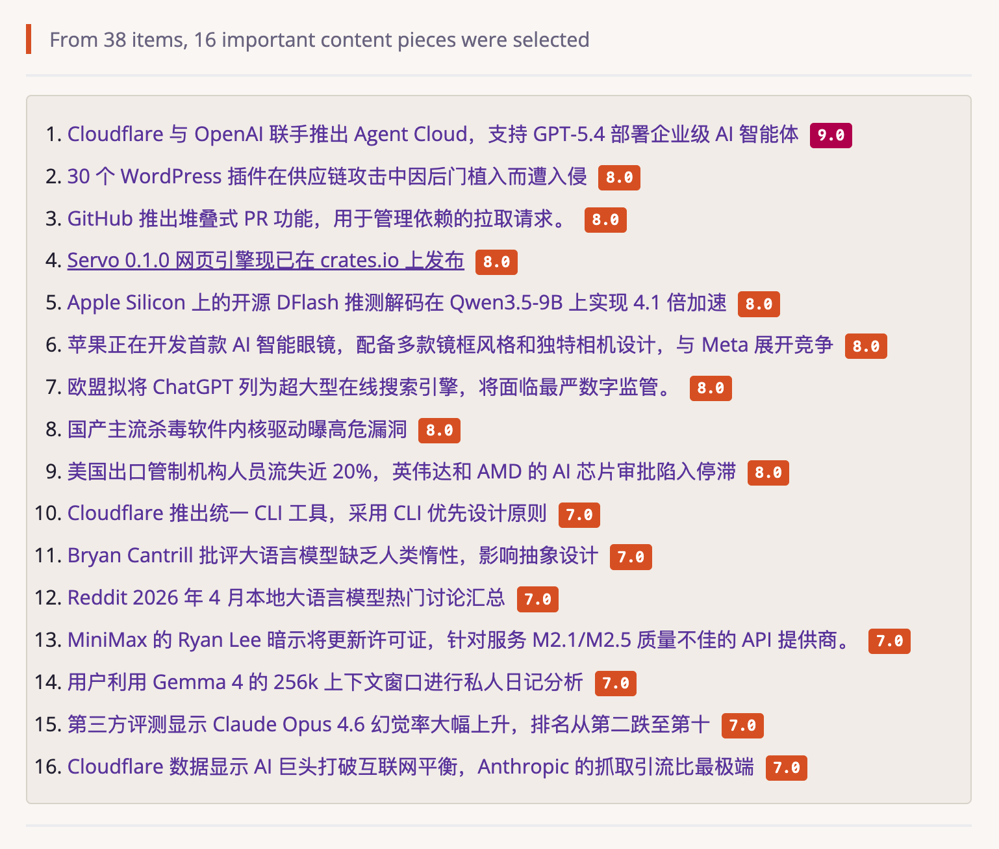
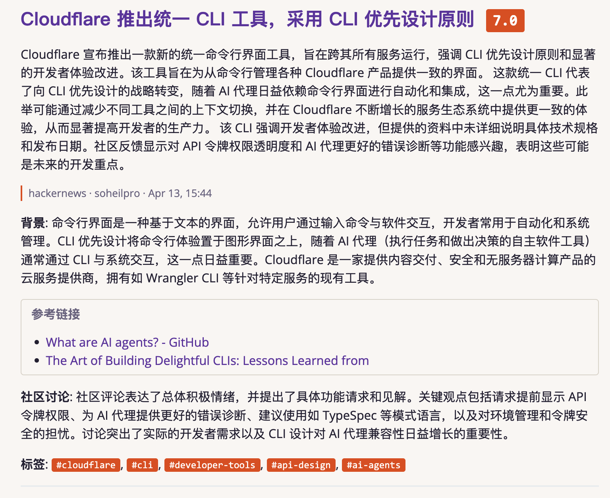
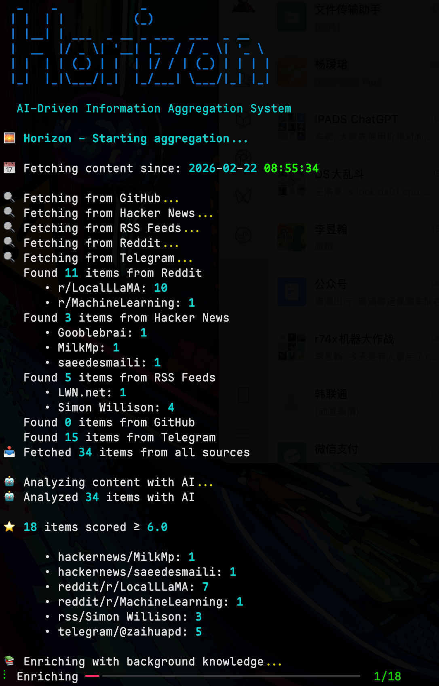
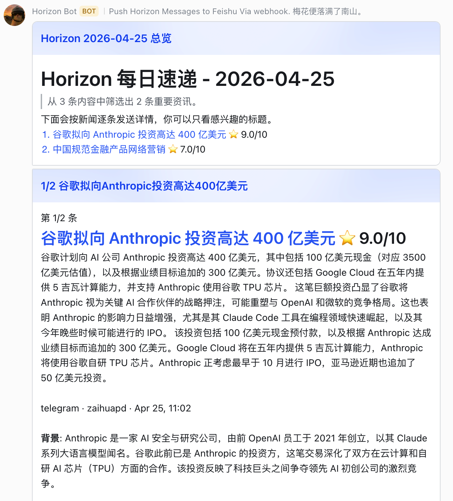
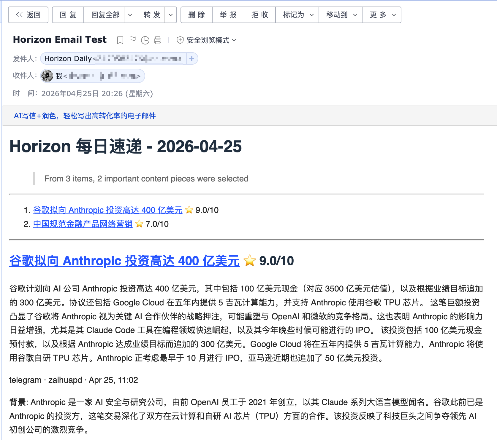
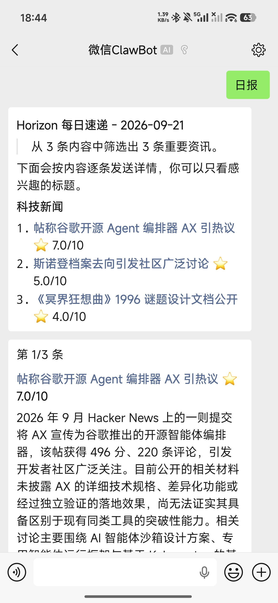
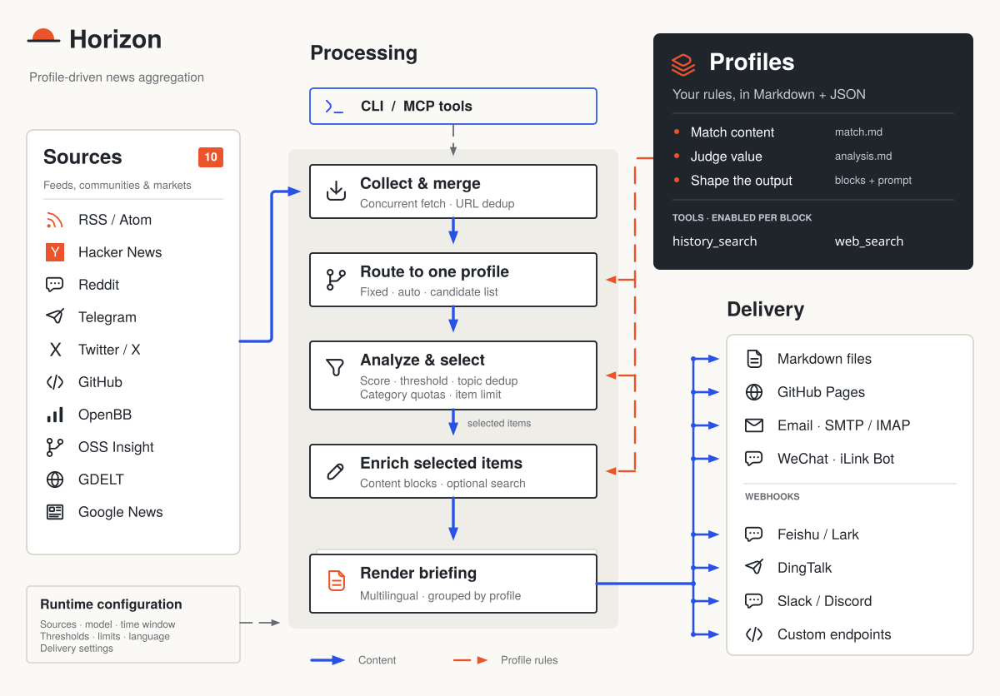
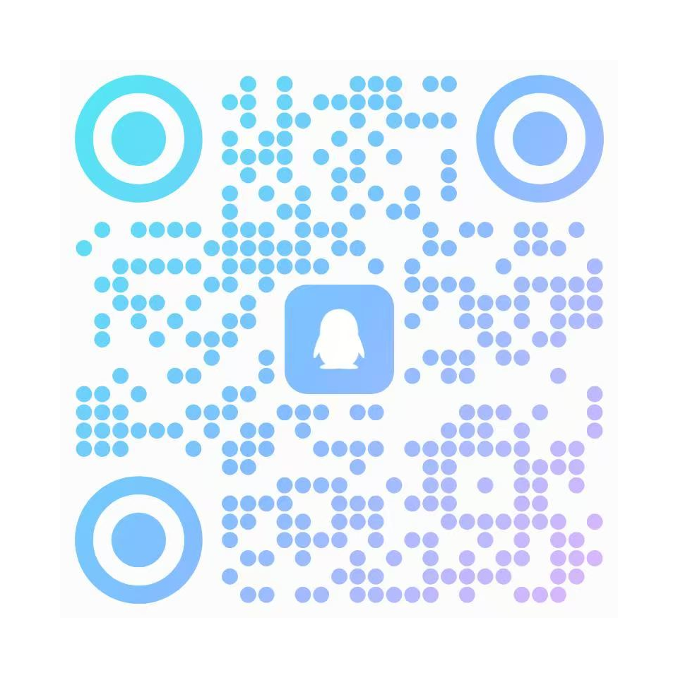

<div align="center">
<h1>🌅 Periscope</h1>

<p><strong>享受新闻本身，其余交给 Periscope</strong></p>

<a href="https://trendshift.io/repositories/22864?utm_source=trendshift-badge&amp;utm_medium=badge&amp;utm_campaign=badge-trendshift-22864" target="_blank" rel="noopener noreferrer"></a>
<a href="https://trendshift.io/repositories/22864?utm_source=trendshift-badge&amp;utm_medium=badge&amp;utm_campaign=badge-trendshift-22864" target="_blank" rel="noopener noreferrer"></a>
<a href="https://hellogithub.com/repository/Thysrael/Periscope" target="_blank"></a>
<br>

[](LICENSE)
[](https://github.com/astral-sh/uv)
[](https://atomgit.com/NLY22/periscope)
[](https://atomgit.com/NLY22/periscope/commits/main)
[](https://atomgit.com/NLY22/periscope/pulls)


📡 你专属的 AI 新闻雷达，自动生成中英双语每日简报。

[📖 在线演示](https://thysrael.github.io/Periscope/) · [📋 配置指南](docs/configuration.md) · [💬 QQ 群](#社区)

</div>

## 截图

<table>
<tr>
<td width="50%">
<p align="center"><strong>按评分排序的每日简报</strong></p>

</td>
<td width="50%">
<p align="center"><strong>背景、摘要与讨论</strong></p>

</td>
</tr>
</table>

<details>
<summary><strong>更多截图</strong></summary>
<br>
<table>
<tr>
<td width="50%" valign="top">
<p align="center"><strong>终端输出</strong></p>

</td>
<td width="50%" valign="top">
<p align="center"><strong>飞书通知</strong></p>

</td>
</tr>
<tr>
<td width="50%" valign="top">
<p align="center"><strong>邮件投递</strong></p>

</td>
<td width="50%" valign="top">
<p align="center"><strong>微信投递</strong></p>

</td>
</tr>
</table>
</details>

## 为什么选择 Periscope？

好的内容散落在订阅源、论坛和时间线里，而你的注意力是有限的。Periscope 会替你收集、筛选、去重，再把真正值得一读的内容连同背景与社区讨论一起送到你面前。

你的品味决定了你读什么，也决定了你希望从中得到什么。一篇新闻报道需要回答「为什么重要」；一篇工程深度长文需要回答「我能用上什么」。Periscope 的 **Profile（画像）** 为每类内容定义各自的评分标准与输出形式，让简报读起来像是为你手工挑选的。

## 功能特性

- **📡 聚合你的信息源** — 订阅 RSS、Hacker News、Reddit、Telegram、X、GitHub、财经资讯等。
- **🎯 判断什么值得读** — 用 Profile 定义评分细则，设置各自的阈值，并在同一 Profile 内合并重复报道。
- **🧩 为每篇内容定制处理方式** — 通过 Markdown 提示词与 JSON block 定义，选择摘要、背景、解决方案或要点。
- **💬 不止于标题** — 在有助于解释事件时，补充联网检索到的背景与社区讨论。
- **⚖️ 兼顾你的所有兴趣** — 限制简报总长度与各分类占比，避免某一热门话题挤占其余内容。
- **📬 在你习惯的地方阅读** — 生成中英双语 Markdown 简报，发布到 Pages，或通过邮件与 Webhook 投递。

### 一份简报，多种读法

Profile 是一套可复用的编辑规则：**什么内容该收录、什么值得保留、该写成什么样。** 内置示例如下：

| 你关注的内容 | Profile | 你将得到 |
|---|---|---|
| 科技新闻 | `tech-news` | 事件与背景，必要时附影响分析与社区讨论 |
| 工程深度长文 | `tech-blog` | 背景、解决方案与可落地的要点 |
| AI 创作者素材 | `ai-creator` | 摘要，必要时附热点切入角度与内容思路 |

你可以为某个信息源指定 Profile，也可以让 AI 自动选择。想要不一样的风格？通常无需改 Python，直接改编现有 Profile 即可。[定制你的 Profile →](docs/profiles.md)

## 工作原理



[可编辑的 OmniGraffle 源文件](docs/assets/architecture.graffle)

**Profile 决定处理方式，运行期配置反映你的阅读偏好。** 每个条目只会路由到一个 Profile。分析、过滤与去重在富化之前完成，随后入选条目按 Profile 分组形成简报。

你可以通过 CLI 运行完整流水线，也可以让 AI 助手经由 [MCP](src/mcp/README.md) 调用其中的各个阶段。

## Periscope 的独有层次：从简报到研究

上游 Horizon 只回答「今天有什么值得读」，并且到了第二天就遗忘。Periscope 保留了四项第一性升级——这正是本 fork 存在的意义：

1. **证据语料库（`corpus.db`）** — 所有曾经采集过的条目都会带 SimHash 指纹与近似重复聚簇被持久化存储，可用 SQLite FTS5（对 CJK 友好）检索。知识会跨运行累积，而不是在生成摘要后就蒸发。
2. **声明级正确性核查** — 高分条目会被蒸馏为原子化、可核查的声明；每条声明都与语料证据关联，并按重复聚簇统计*独立信源*：一份通稿被十家媒体转载，只算一票而非十票。评级（supported / contested / unsupported + 置信度）每轮有预算上限。
3. **长会话研究** — 提出一个问题，会得到一棵分解后的子问题树，逐题对照语料取证，并输出带引用的 Markdown 报告。追问会在同一会话上跨天、跨重启迭代（状态保存在 SQLite 中）。
4. **处处诚实降级** — 没有 LLM key？语料照常增长，证据照常确定性关联，报告会写明*「尚未回答」*并附上已收集的证据，而不是编造内容。默认 LLM 是免费的 **Agnes** 层（`agnes-2.5-flash`），且每次调用都经过持久化响应缓存与限流，因此崩溃恢复运行与重复提示词都不消耗额外额度。

### 驱动它

```bash
# 终端：一次采集（fetch -> score -> digest -> corpus + claims）
uv run periscope --hours 24

# Web 面板：证据库 / 研究报告 / 核查台（http://localhost:8790）
uv run periscope-web --data-dir data

# MCP：面向任意 MCP 客户端的 22 个工具（hz_research_start、hz_corpus_search 等）
uv run periscope-mcp
```

配置键：`corpus`、`analysis`、`research`（见 `data/config.example.json`）。把 `.env` 指向 `AGNES_API_KEY` 即可获得完整体验；不配置任何 key，其余功能也能运行。

## 快速开始

### 1. 安装

**方式 A：本地安装**

```bash
git clone https://atomgit.com/NLY22/periscope.git
cd periscope

# 使用 uv 安装（推荐）
uv sync

# 需要测试/开发依赖时
uv sync --extra dev

# 或使用 pip
pip install -e .
```

`dev` 目前是 `pyproject.toml` 中的可选 extra，因此安装 pytest 等开发依赖请使用 `uv sync --extra dev`。

如果你想启用可选的 OpenBB 财经新闻源，还需要安装它的 extra：

```bash
uv sync --extra openbb
```

如果 `openbb` 在你的机器上拉取到没有 wheel 的包，可只用二进制方式手动安装 SDK：

```bash
uv pip install --only-binary=:all: openbb openbb-benzinga
```

**方式 B：Docker**

```bash
git clone https://atomgit.com/NLY22/periscope.git
cd periscope

# 可选：首次运行前用逗号分隔的 extras 构建
docker compose build --build-arg EXTRAS=openbb periscope-collect
```

基于 `trafilatura` 的正文抽取已包含在基础安装中。`twitter` extra 还需要 Playwright 浏览器与系统依赖，当前 Dockerfile 并未安装。

### 2. 配置

**方式 A：交互式向导（推荐）**

```bash
uv run periscope-wizard
```

向导会询问你的兴趣（例如「LLM 推理」「嵌入式」「Web 安全」），并自动生成 `data/config.json`。CLI 选项见[交互式向导](docs/configuration.md#interactive-wizard)。

**方式 B：手动配置**

```bash
cp .env.example .env          # 填入你的 API Key
cp data/config.example.json data/config.json  # 定制你的信息源
```

最小手动配置示例：

```jsonc
{
  "ai": {
    "provider": "openai",
    "model": "gpt-4",
    "api_key_env": "OPENAI_API_KEY"
  },
  "sources": {
    "rss": [
      {
        "name": "Simon Willison",
        "url": "https://simonwillison.net/atom/everything/",
        "profile": "tech-news"
      }
    ]
  },
  "processing": {
    "profiles_dir": "profiles",
    "default_profile": "tech-news",
    "profile_settings": {
      "tech-news": {
        "threshold": 7.0,
        "topic_dedup": true
      }
    }
  }
}
```

信息源显式指定 `profile` 时会直接使用该 Profile；省略或设为 `"auto"` 时，由 AI 将条目与所有可用 Profile 进行匹配；设为数组（如 `["tech-news", "finance-news"]`）则把 AI 匹配限定在这些 Profile 内。Profile 的结构与行为见[处理画像](docs/profiles.md)。诸如评分阈值、主题去重之类的**单 Profile 用户偏好**应写在 `processing.profile_settings`，而不是 Profile 文件里。

**均衡简报（可选）**

限制最终简报的规模，避免某一分类独占结果。分类来自信息源配置，例如 `sources.rss[].category`。

```jsonc
{
  "digest": {
    "max_items": 20,
    "category_groups": {
      "ai": {
        "limit": 5,
        "categories": ["ai-news", "ai-tools", "machine-learning"]
      },
      "finance": {
        "limit": 5,
        "categories": ["finance", "business", "equities"]
      }
    },
    "default_group": "other",
    "default_group_limit": 3
  }
}
```

分组限额在 Profile 过滤之后、富化之前生效。省略 `category_groups` 与 `max_items` 时，不施加均衡简报限制。

`api_key_env` 必须是**环境变量的名字**，而不是 API Key 本身。把真正的密钥放进 `.env`：

```bash
OPENAI_API_KEY=sk-your-key
```

使用 Gemini 时，改为 `GOOGLE_API_KEY`：

```jsonc
{
  "ai": {
    "provider": "gemini",
    "model": "gemini-2.0-flash",
    "api_key_env": "GOOGLE_API_KEY"
  }
}
```

`data/config.json` 中任意字符串值都可以用 `${VAR_NAME}` 引用环境变量，适用于 `ai.base_url`、私有 RSS 源地址、Webhook 端点或自定义请求头模板等。

完整参考见[配置指南](docs/configuration.md)。

### 3. 运行

**A. 本地安装**

```bash
uv run periscope [OPTIONS]
```

**B. Docker**

```bash
# 采集器，运行一次
docker compose run --rm periscope-collect --hours 24
# Web 面板，端口 8790
docker compose up -d periscope-web
```

| 选项 | 默认值 | 说明 |
|------|--------|------|
| `--hours N` | 取 `collection.time_window_hours`（示例配置为 24） | 抓取最近 N 小时的内容 |
| `-d`, `--data-dir PATH` | `data` | 数据目录路径 |
| `-c`, `--config PATH` | `<data-dir>/config.json` | 配置文件路径 |
| `-l`, `--log-level LEVEL` | `WARNING` | 日志级别（DEBUG/INFO/WARNING/ERROR/CRITICAL） |

`--data-dir` 会改变状态目录，包括摘要、订阅者以及默认配置位置；`--config` 只改变配置文件。生成的报告保存在 `data/summaries/`（若设置了 `--data-dir` 则为 `<data-dir>/summaries/`）。两者组合使用及自定义配置位置的初始化方式见[配置路径](docs/configuration.md#configuration-paths)。

除主命令外，Periscope 还提供以下入口：

| 命令 | 用途 |
|------|------|
| `periscope` | 运行一次完整流水线（采集 → 评分 → 摘要 → 语料 + 声明核查） |
| `periscope-wizard` | 交互式配置向导，生成 `data/config.json` |
| `periscope-web` | 证据库 / 研究报告 / 核查台 Web 面板（默认 `:8790`） |
| `periscope-mcp` | MCP 服务（stdio，22 个工具 + resources） |
| `periscope-webhook` | Webhook 连通性测试与干跑预览 |
| `periscope-wechat` | 微信 iLink 登录 / 状态 / 测试发送 |

### 4. 自动化（可选）

使用 **GitHub Actions** 定时运行 Periscope，可参考[每日工作流模板](.github/workflows/daily-summary.yml.disabled)。该模板在本仓库中处于禁用状态；配置好你的部署方式后，将其重命名为 `daily-summary.yml` 即可启用。

## 支持的 AI 提供商

默认使用免费的 **Agnes** 层，其余提供商可任选其一，或通过 `provider_chain` 组合成降级链。

| 提供商 | 默认模型 | API Key 环境变量 |
|--------|----------|------------------|
| `agnes`（默认，免费层） | `agnes-2.5-flash` | `AGNES_API_KEY` |
| `anthropic` | `claude-3-5-sonnet-20241022` | `ANTHROPIC_API_KEY` |
| `openai` | `gpt-4` | `OPENAI_API_KEY` |
| `azure` | `gpt-4` | `AZURE_OPENAI_API_KEY` + `AZURE_OPENAI_ENDPOINT` |
| `gemini` | `gemini-1.5-flash` | `GOOGLE_API_KEY` |
| `ali`（通义千问） | `qwen-plus` | `DASHSCOPE_API_KEY` |
| `doubao`（豆包） | `doubao-pro-32k` | `DOUBAO_API_KEY` |
| `minimax` | `MiniMax-M3` | `MINIMAX_API_KEY` |
| `deepseek` | `deepseek-chat` | `DEEPSEEK_API_KEY` |
| `ollama`（本地部署） | `llama3.1` | 无需 Key |

设置 `ai.provider_chain`（逗号分隔的提供商列表）即可启用链式回退：遇到 429/限流、401/403/额度不足、502/503 或空响应时，自动切换到下一个提供商。

## 支持的数据源

| 数据源 | 抓取内容 | 评论 / 附加能力 |
|--------|----------|-----------------|
| **Hacker News** | 按分数排序的热门帖子 | 是（前 N 条评论） |
| **RSS / Atom** | 任意 RSS 或 Atom 源 | — |
| **Reddit** | 子版块 + 用户帖子 | 是（前 N 条评论） |
| **Telegram** | 公开频道消息 | — |
| **Twitter / X** | 用户时间线 + 关键词搜索（Apify） | 是（前 N 条回复） |
| **GitHub** | 用户事件与仓库 Release | — |
| **OpenBB** | 按自选股/提供商抓取公司财经新闻 | — |
| **OSS Insight** | 开源趋势仓库 | — |
| **GDELT** | 匹配搜索词的全球新闻 | — |
| **Google News** | 经 RSS 的新闻搜索 | — |
| **Bilibili** | 热门视频（标题、统计、热门评论；有 CC 字幕时提取转录） | 是 |
| **V2EX** | 节点主题 + 热门主题，含回复 | 是 |
| **Discourse** | 任意 Discourse 论坛的最新主题（如 Rust Users） | 是 |
| **YouTube** | 经官方公开 atom feed 抓取频道更新（标题 + 描述文本） | 是 |

## 简报的投递渠道

Periscope 可以通过多种方式发布或投递生成的简报：

| 渠道 | 作用 |
|------|------|
| **GitHub Pages 每日站点** | 把生成的 Markdown 复制到 `docs/`，由 GitHub Pages 发布每日更新的简报站点 |
| **邮件订阅** | 向订阅者发送每日简报，并通过 SMTP/IMAP 处理订阅/退订请求 |
| **Webhook 通知** | 把成功或失败结果推送到飞书/Lark、钉钉、Slack、Discord 或任意自定义 Webhook 端点 |
| **微信通知** | 通过 iLink Bot 在扫码登录并收到你的消息后发送简报；受微信回复条数限制 |

投递配置见[配置指南](docs/configuration.md)。若要从 AI 助手运行流水线各阶段，请使用 **MCP Server**：[工具说明](src/mcp/README.md) · [客户端配置](src/mcp/integration.md)。

## 赞助支持

Periscope 是一个利用业余时间维护的开源项目。如果你想支持本项目或希望出现在此列表中，欢迎[提交 Issue](https://atomgit.com/NLY22/periscope/issues/new)或[邮件联系](mailto:thysrael@163.com)。

| 支持者 | 详情 |
|-----------|---------|
| [](https://www.compshare.cn/?ytag=GPU_YY_git_Periscope) | Compshare 目前为 Periscope 提供支持。Compshare 是 UCloud 旗下的 AI 云平台，提供高性价比的包月与按量付费国内模型 Agent 方案，低至 49 元/月起，同时提供稳定官方转发的海外模型，支持 Claude Code、Codex 及 API 使用，具备企业级高并发、7×24 技术支持与自助开票能力。<br><br>通过他们的[链接](https://www.compshare.cn/?ytag=GPU_YY_git_Periscope)注册可获赠 5 元试用额度。 |
| [](https://go.apimart.ai/gh-periscope) | 感谢 APIMart 赞助本项目！APIMart 是一个低成本的 AI 图像与视频生成 API 平台——GPT-Image-2 低至 $0.006/张，一美元可生成 160+ 张图片。一套异步 API 同时覆盖图像与视频：提交任务、获取 ID、通过轮询或回调取回结果。可批量处理数万张图片而不超时，切换模型无需改动代码。按量付费、无月费——[点此注册](https://go.apimart.ai/gh-periscope)即可开始。 |
| [](https://ofox.ai/?utm_source=github&utm_medium=sponsorship&utm_content=periscope) | OfoxAI 是一个统一的 AI API 平台，汇集多家提供商的文本、图像与视频模型。凭借 OpenAI 兼容端点以及原生 Anthropic 与 Gemini 接口，开发者可通过一个平台访问用于 AI 应用、Agent 与内容创作的各类模型。<br><br>[探索 OfoxAI 的模型与 API →](https://ofox.ai/?utm_source=github&utm_medium=sponsorship&utm_content=periscope) |

## 文档

| 指南 | 说明 |
|------|------|
| [配置](docs/configuration.md) | AI 提供商、信息源、Profile、过滤、邮件、Webhook、微信、GitHub Pages 与 MCP 配置 |
| [处理画像](docs/profiles.md) | Profile 路由、提示词、运行期过滤偏好、富化 block 与工具 |
| [评分](docs/scoring.md) | Periscope 如何评估与排序新闻条目 |
| [抓取器](docs/scrapers.md) | 各数据源抓取器细节与扩展说明 |
| [正文抽取](docs/extractors.md) | RSS 源的全文抽取 |
| [MCP 工具](src/mcp/README.md) | 面向 MCP 兼容客户端的工具参考 |
| [架构与生态设计](docs/horizon-hub-design.md) | HorizonHub 数据源市场与推荐的产品设计 |

## 项目状态

Periscope 已支持完整的每日简报闭环：多源采集、Profile 驱动的分析与富化、去重、评论摘要、双语生成、GitHub Pages 发布、邮件投递、Webhook 投递、微信投递、Docker 部署、MCP 集成与配置向导。

本 fork 在此基础上额外提供四层持久化能力（见上文[「Periscope 的独有层次」](#periscope-的独有层次从简报到研究)），并已提供 Web 面板这一独立入口。

后续计划：

- 支持更多数据源类型，例如 Discord
- 在 AtomGit 上发布 Release
- 发布到 PyPI，支持 `pip install`

## 社区

欢迎加入 Periscope 用户与开发者 QQ 群，分享信息源、Profile 与部署经验。

<p align="center">
  
  <br />
  <strong>QQ 群：1106121909</strong><br />
  用 QQ 扫码或搜索群号加入。
</p>

## 贡献

欢迎贡献。代码、文档与信息源分享的规范见 [CONTRIBUTING.md](CONTRIBUTING.md)。

### 分享信息源

想把发现的优质信息源分享给 Periscope 社区？请通过 **[periscope1123.top](https://periscope1123.top)** 提交。

## 致谢

- 特别感谢 [LINUX.DO](https://linux.do/) 提供推广平台。
- 特别感谢 [HelloGitHub](https://hellogithub.com/) 提供宝贵的指导与建议。
- 特别感谢 [AIGC Link](https://xhslink.com/m/80ngts127cA) 在小红书上的推广。

## 许可证

[MIT](LICENSE)
