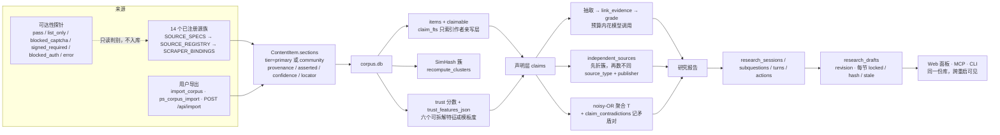
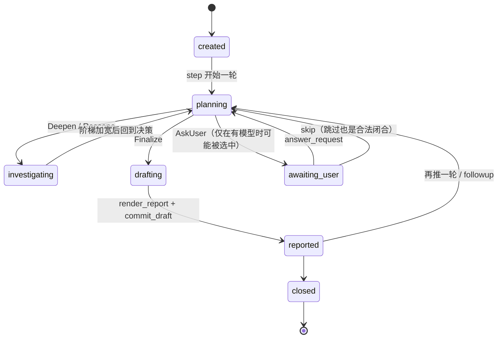
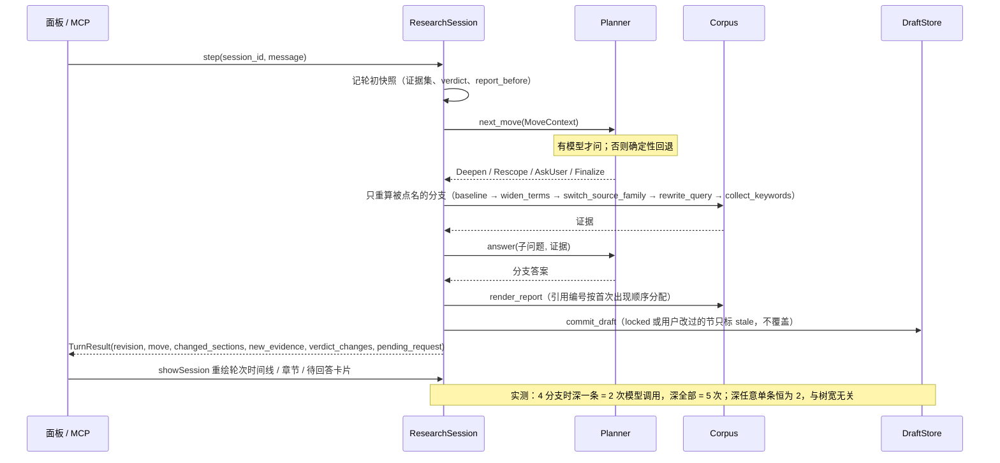

# 架构图（spec §8 的 1、2、3 号）

这三张图是 spec §8 图表清单里的**结构性图**，不是数据图。数据图那边：6、7 号已经画成 SVG（`docs/assets/flood-independence.svg`、`docs/assets/recompute-cost.svg`，由 `scripts/render_eval_charts.py` 从 `data/eval/multiturn_results.json` 纯标准库渲染，见 [evaluation.md](evaluation.md)）；4、5 号还画不出来 —— 它们要 50–100 条人评声明标注，数据为零。

每张图下面都写清**它的说法在代码里落在哪**，并由 `tests/test_docs_match_code.py` 里的图元护栏钉住：图里出现的状态名、动词名、表名必须在代码里存在，改了代码不画图就会红。

> 渲染说明：上面三张是 mermaid 代码块，GitCode / GitHub 的 Markdown 视图会直接画出来。**本机没有可用的 mermaid CLI，所以"mermaid 渲染长什么样"没有被验证过**，被验证的是内容与代码一致（见上）。两张 SVG 数据图的验证更强一层：`tests/test_eval_charts.py` 用 XML 解析器确认它们是格式正确的独立图片、几何落在画布内、且**每个画出来的数字都来自那份 JSON**；Chromium 也能把它当 `` 载入（无障碍树里读到了标题），但**像素层面仍未看过的** —— 会话的浏览器没有可见 surface，截不了图。谁引用这两张图，就带上这句。

---

## 1. 广源 → 可用证据：一条内容走过的路

**读法。** 三层防线依次是：分层决定"这话是不是作者说的"，trust 决定"该信多少"，独立性计数决定"有几个互不相同的人在说"。导出通路走同样三层 —— 它买的不是免检，只是另一个来源方式（`manual_export`，折扣 0.85）。

**代码落点。** `src/models.py`（`Section` / `ContentItem` / `SOURCE_SPECS` 派生出 `SOURCE_REGISTRY`）· `src/sources/registry.py`（`SCRAPER_BINDINGS`：key → 工厂）· `src/corpus/store.py`（schema v4、`claimable`、`claim_fts`、簇）· `src/corpus/trust.py` · `src/corpus/ingest.py` · `src/analysis/claims.py` · `src/research/session.py` · `src/research/moves.py` · `src/research/drafts.py` · `src/sources/reachability.py`。

**这张图背后的表：12 张普通表 + 2 张 FTS5 虚表**（除 `llm_cache.db` 外都在同一个 `corpus.db` 里，所以三个入口共享状态）：

| 表 | 类型 | 谁建 / 谁写 | 作用 |
|---|---|---|---|
| `items` | 普通 | `Corpus.add_items` | 条目本体 + `claimable` + `locator` / `time_basis` / `sections_json` / `publisher` / `trust` / `trust_features_json` |
| `runs` | 普通 | `begin_run` / `finish_run` | 每轮采集的新增与总量，崩溃续跑靠它 |
| `claims` | 普通 | `ClaimStore`（`ClaimAnalyzer` 调） | 原子声明 + `verdict` + `verdict_source`（这条判定来自模型还是可信度门） + `independent_sources` + `trust` + `ungraded_reason` |
| `claim_evidence` | 普通 | `link_evidence` | 声明↔条目的关联，带 `cluster_id` 与 `source_type` |
| `claim_contradictions` | 普通 | `record_contradiction` | 哪两条声明、靠哪些条目互相冲突 —— `contested` 的可查依据 |
| `research_sessions` | 普通 | `ResearchStore` | 会话与其状态（含 `awaiting_user`） |
| `research_subquestions` | 普通 | 同上 | 子问题树、答案、证据 id（`open` / `answered` / `dropped`） |
| `research_turns` | 普通 | 同上 | 逐轮轨迹（`user` / `assistant_question` / `report`） |
| `research_actions` | 普通 | `_gather_until_enough` | 加宽阶梯的每一步动作与新增条数，报告里的"取证尝试" |
| `research_drafts` | 普通 | `DraftStore.save` | 草稿每个 revision 的章节（`locked` / `hash` / `stale` / `evidence_ids`） |
| `research_requests` | 普通 | `DraftStore.open_request` | 系统向用户提的问题及其闭合（`open` → `answered` / `skipped`） |
| `embeddings` | 普通 | 语义索引（配了 embedding 模型才建） | 按模型名分键的向量侧，缺它检索退化成纯 BM25，不报错 |
| `items_fts` | FTS5 虚表 | `Corpus`（`_SCHEMA` 里的触发器同步） | 全文召回：`title` + `content` + `author`，**含社区层**，面板要的是召回 |
| `claim_fts` | FTS5 虚表 | 同上 | 取证与证据关联只走它，因而**只索引作者亲写层** —— 分层就是靠这两张虚表的差别生效的 |

`llm_cache.db` 是另一个文件（`ResponseCache`），只存模型响应缓存，与证据状态无关，所以不在这张表里。

---

## 2. 研究会话状态机（`awaiting_user` 是一等状态）

**为什么 `awaiting_user` 必须是一等状态。** 它不是错误也不是结束：`ps_research_list` 与面板要能看出"这个会话在等你"，并且能被恢复；若把它塞回 `planning`，用户看到的就是一个永远在转圈的会话。

**关键约束。** `AskUser` 只在有可用模型时才可能被选出：无 LLM 时的确定性回退只会产出 `Deepen` / `Finalize`，所以联系不到模型的会话会终止，不会开始连环追问。请求可以 `answered` 也可以 `skipped` —— 拿不到输入是常态，不是死锁。

**代码落点。** 状态字面量在 `src/research/session.py` 的 `Session.status` 注释与 `set_session_status`；动词与回退顺序在 `decide_move`；parked 会话的可列与恢复由 `tests/test_research_p2.py::test_a_parked_session_can_still_be_listed_and_resumed` 钉住。

---

## 3. 一轮交互的时序（含实测调用数）

**这张图的重点是"局部"。** `step` 不重走整棵树；被点名的分支才算答案，引用编号每轮可以重排而章节身份不变，所以用户的锁不会漂到别的小节。

**代码落点。** `ResearchSession.step` / `_deepen` / `commit_draft`；调用数比值的复现命令是 `uv run python scripts/eval_multiturn.py`（数字出处，不是估的）。
