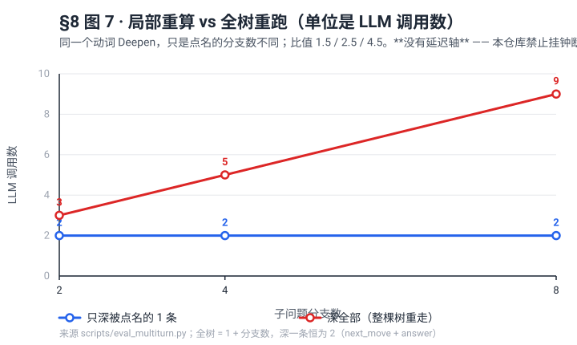
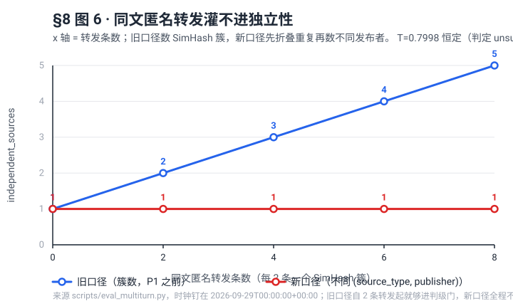

# 检索与取证评测（Phase F 的验收依据）

这份文档回答一个问题：**Periscope 在 Horizon 之上加的这几层，到底让"从噪声里取出可用证据"变好了多少？**
所有数字都可复现：

```bash
uv run python scripts/eval_retrieval.py          # 打印消融表，并写 data/eval/results.json
uv run pytest tests/test_eval_metrics.py         # 指标实现 + harness 的行为断言
```

## 方法

- **语料**：`data/eval/corpus_fixture.json`，19 条 —— 10 条承载答案的信号项 + 9 条**同词不同事**的干扰项（别家的融资轮、`Series B` 名词解释、Northwind 招人、与融资无关的 OpenForge 帖子、`did not close` 的英文轶事）。干扰项是刻意的：没有它们，recall@10 恒等于 1，任何改动都"看起来有效"。
- **标注**：`data/eval/queries.json`，5 个子问题，分级相关度 `2 = 作者亲写文本直接判定该问题（含相互矛盾的说法）`，`1 = 切题但只给部分`。**只在评论/回复里出现的说法一律标 0**，因此把人群噪声当证据的检索会被扣分——这正是分层要解决的问题。
- **指标**：标准 IR 口径，未自创（`src/corpus/metrics.py`）：Recall@5/@10、Precision@5、nDCG@10（增益 `2^g - 1`）、MRR。
- **消融配置**：同一份语料、同一批查询，只换检索策略。

## 结果（2026-09-26 本机运行，Python 3.12 / SQLite FTS5）

| 配置 | recall@5 | recall@10 | precision@5 | nDCG@10 | MRR |
|---|---|---|---|---|---|
| A 旧行为（全量文本，单词条） | 0.733 | 0.883 | 0.640 | 0.830 | 1.000 |
| B A+证据分层 | 0.758 | 0.875 | **0.680** | **0.850** | 1.000 |
| C B+放宽词条 | 0.675 | **1.000** | 0.600 | 0.891 | 1.000 |
| D B+查询扩展（stub） | **0.792** | 1.000 | **0.720** | **0.934** | 1.000 |
| E B+语义路（stub） | 0.758 | 0.967 | 0.680 | 0.904 | 1.000 |
| F 全开（分层+扩展+语义+放宽） | 0.758 | **1.000** | 0.680 | 0.928 | 1.000 |

> 这张表与 `data/eval/results.json` **逐格对齐**，由 `tests/test_docs_match_code.py::test_ablation_table_matches_the_stored_eval_run` 检查（最后一位偏移也红），并有一条用例专门验证那个检查真的会红。要改数字先重跑 `uv run python scripts/eval_retrieval.py`，再改表 —— 而不是只改表。

读法（包括不好看的部分）：

1. **证据分层买的是准度和排序，不是覆盖**：B 相对 A，precision@5 `0.640 → 0.680`、nDCG@10 `0.830 → 0.850`，而 recall@10 反而从 `0.883` 掉到 `0.875` —— 有极少数条目只有评论区提到过，分层后就不算证据了。这是有意的取舍：报告宁可少一条来源，也不能把一个陌生人的回帖当信源。
2. **查询扩展是当前收益最大的一层**（D）：召回、准度、nDCG 全部最高。注意表中用的是**词形替身（stub）**，它证明"只要扩展给出跨语言/别名词形，指标就会涨"这条通路是通的，**不代表真实模型的效果**；真实数字要 `--expander llm` 跑。
3. **放宽词条换覆盖、丢精度**（C）：recall@10 满格，但 recall@5 `0.675`、precision@5 `0.600` 全表最低。所以 F3 的加宽阶梯把它排在第二位且有轮次预算，不是无脑放宽。
4. **语义路（E）在 19 条的小语料上只是"补漏"**：recall@10 `0.967`。它的价值要到语料上万条时才显现，现在的数字只能证明接线正确。

## 分层的实现方式（P0 之后变了）

上面那张表的 B 行（"A+证据分层"）是在**标记反解**的实现上测出来的：`src/corpus/sections.py` 扫 5 个精确中文字符串（`【评论区 Top】` 等），把条目正文切成作者层 / 人群层，只有作者层进 `claimable` 列、被 `claim_fts` 索引、参与证据关联与独立源计数。

P0 把判据换成了 scraper **声明**的类型化字段 `ContentItem.sections`（`Section(tier=…, author=…, provenance=…, asserted=…)`）。对评测有三点影响：

1. **这张表的数字仍然成立，但口径要说清。** A/B 两行测的是同一个 fixture（`data/eval/corpus_fixture.json`，其中人群文本用中文标记拼接），marker 路径与 sections 路径在这份语料上切出的层是一样的。要复现 A/B 行请用 `--tiering=marker`，该路径被显式保留。
2. **marker 路径不能读英文标记，而这一点对解读 A 行是实质性的。** `reddit.py`、`hackernews.py`、`twitter.py` 拼接的是 `--- Top Comments ---`，不在那 5 个中文标记里。所以在 P0 之前，这三个源的人群文本**整段**被当作作者亲写进入 `claimable`（HN 链接帖最坏：正文 100% 是评论）。当前 fixture 不含这类条目，因此表里的数字没有反映这个泄漏；换句话说，**B 行"分层买到的准度"是被低估的下界**，把噪声源真正接进来以后差距只会更大。这是 P0 的验收测试（`tests/test_tier_guard.py`）先在 `main` 上跑红的原因。
3. **老库的层是推断出来的，不是声明的。** schema v3 之前的行在打开数据库时由 marker 路径重建，并统一打上 `provenance="legacy_marker"`。引用这些行时不要说"分层问题已彻底修复"——老数据的层仍来自字符串约定。

另有两处与评测口径直接相关的实现变化：`independent_sources` 的计数逻辑**未变**（P1 才改），`claimable_only` 消融开关**未变**；变的是它读的是 sections 而非标记。日报侧的 `processing/content.py:split_content` 保留，新增 `split_item_content` 优先读 sections，以保证日报与取证两条链路对同一条目切出同样的层。

## 可信度与独立性（P1 之后）

`scripts/eval_retrieval.py --tiering=marker|sections` 现在能在**同一份语料**上分别跑两档分层判据：`sections` 读 scraper 声明的层级，`marker` 复现 P0 之前的标记反解（消融 A 档）。两档结果写进 `data/eval/results.json` 的 `tiering` 字段，因此引用任何一个数字都能说清它是在哪档下测的。当前 fixture 的人群文本本来就用中文标记拼接，所以两档数字相同；差异只在**已迁移的源**上出现（它们不再写任何标记），这一点由 `tests/test_trust_p1.py::test_marker_tiering_ignores_declared_sections` 钉住。

P1 换掉了两个门的口径，评测时要注意：

1. **独立信源数不再是簇数。** 先按簇折叠重复内容，再数不同的 `(source_type, publisher)`；**发布者解析不出来的条目不投票**。同一作者换个源重复一次，仍算两个 `(type, publisher)` —— 这是 spec §5.2.2 的规则，也是它已知的软肋（一个人有 newsletter 又有 HN 账号会被数成两族）。防线是第一步的簇折叠，不是发布者匹配。
2. **`T(claim)` 是 noisy-OR，不是求和**：`T = 1 − Π(1 − trust_i·d_i)`，同族第 2 个发布者按 `d_i=0.5` 折半。求和没有上界，足够多的低质源能把任何结论刷成 supported；noisy-OR 不行，这一点有专门的回归测试。
3. **报告里 `unsupported` 拆成两种**，并且**未评级的声明现在可见**（附原因）：
   `⏳ 未评级（低于分诊门）` / `🔍 证据不足` / `🏷️ 无可核验发布者` / `❌ 可信度不足（T=…）`。
   这与本文早先"`unsupported` 与 FEVER `not_enough_information` 不合并"的说法不冲突：那句话说的是**已评级**的 `unsupported` 语义，这里补的是"根本没走到评级"这一类以前被过滤器藏起来的。
4. **`contradicted` 现在可查**：`claim_contradictions` 表记录是哪两条声明、靠哪些条目互相冲突，由 `grade_claim` 阶段模型显式给出。

### θ 还没有校准

`triage_min_trust` 默认 `0.0`（等于不启用信任门，保持 P0 行为），`Thresholds(supported=0.55, triage=0.30)` 是**手工先验，不是拟合结果**。`roc_thresholds()` 已经实现（网格搜 F1 最大点，并带折扣），但在 `data/eval/claims_labels.json` 存在之前它没有输入可吃——它在样本不足两个类别时返回 `None` 而不是编一个数。

所以下面这条仍然是本项目**唯一"能力已实现、效果未主张"**的一块，也是 P1 验收里只有你能做的那半步：

```bash
uv run python scripts/eval_claims.py --export data/corpus.db --tiering=sections
uv run python scripts/eval_claims.py --score  data/eval/claims_labels.json --tiering=sections
```

50–100 条人工 verdict 到位后，`roc_thresholds()` 给出 θ_s 与 θ_triage，届时才能主张"信任门在人工判定上一致率是多少"。在此之前任何 θ 数字都是假设。

## 多轮成本与灌水抵抗（spec §5.5 的客观量）

IR 指标量不了"多轮"这件事，而人评还没开始。所以 spec §5.5 里那组**系统客观量**先由一个不联网、不花额度的替身规划器测出来：

```bash
uv run python scripts/eval_multiturn.py                    # 打印三张表并写 data/eval/multiturn_results.json
uv run python scripts/render_eval_charts.py                # 从那份 JSON 重画 §8 的 6、7 号图（纯标准库，不引绘图依赖）
uv run python scripts/render_eval_charts.py --check        # 图与数据不一致就退出非零
uv run pytest tests/test_eval_multiturn.py tests/test_eval_charts.py   # 这些数字与这两张图的护栏
```

**成本单位是 LLM 调用数，不是毫秒。** 本仓库禁止挂钟断言（P0 为此返工过一次），所以这里没有延迟数据；引用时说"调用数"，别说"快了多少毫秒"。

### 局部重算 vs 全树重跑

同一个语料、同一个动词（`Deepen`），只是点名的分支数不同：

| 分支数 | 深一条 | 深全部 | 比值 |
|---|---|---|---|
| 2 | 2 | 3 | 1.5 |
| 4 | 2 | 5 | 2.5 |
| 8 | 2 | 9 | 4.5 |

深一条恒等于 **2**（一次 `next_move` + 一次 `answer`），全树是 `1 + 分支数`。**比值随树宽线性增长** —— 这正是"逐轮交互"在长报告上还能负担的原因；反过来说，分支很少时逐轮几乎没有节省，别把这个数字当成普适结论。



### 轮次到定稿（含一轮系统主动提问）

| 轮 | 动词 | 调用数 | revision | 会话状态 |
|---|---|---|---|---|
| 1 | `askuser` | 1 | 1 | `awaiting_user` |
| 1.5 | `answer_request` | 2 | 2 | `reported` |
| 2 | `finalize` | 1 | 2 | `drafting` |

2 轮到定稿、多轮阶段共 8 次调用（含建会话时的拆解与逐条回答）。`awaiting_user` 是一等状态：面板与 `hz_research_list` 能列出 parked 会话，回答后 `revision` 继续增长、不新建会话。

### 灌水抵抗

一条署名分析 + N 条同文匿名转发（每 2 条一个 SimHash 簇），旧口径与 P1 口径一起报：

| 转发数 | 簇数 | `independent_sources` 旧口径 | 新口径 | `T` | 判定 |
|---|---|---|---|---|---|
| 0 | 1 | 1 | 1 | 0.7998 | unsupported |
| 2 | 2 | 2 | 1 | 0.7998 | unsupported |
| 4 | 3 | 3 | 1 | 0.7998 | unsupported |
| 6 | 4 | **4** | **1** | 0.7998 | unsupported |
| 8 | 5 | 5 | 1 | 0.7998 | unsupported |



旧口径（`COUNT(DISTINCT COALESCE(cluster_id, item_id))`）在脚本里**显式重放**，不在生产代码里 —— 和 `--tiering=marker` 保留 A 档是同一个理由：比较必须继续可查。三点读法：

1. 旧口径 6 条转发就能凑到 `independent_sources=4`，而 `grade_min_sources` 默认 2 —— 它本来会被送进判级；新口径恒为 **1**，因为匿名条目**不投票**。
2. 曲线是平的：`T` 不随转发条数变化（无发布者 → 不进 `noisy_or` 的乘积），所以"量"换不到任何东西。
3. 不好看但要说的一面：`T=0.7998` 已经越过 `supported=0.55`，判定仍是 `unsupported`，因为规则还要求**跨族宽度**或**同族 ≥3 个发布者**。后果是**一篇独立硬稿单独构不成 supported** —— 这是 §5.2.2 的设计意图，但它是否正确，只有人评能判，这正是上面那半步没做完的原因。

已知软肋同样给了数字，不留在叙述里：**同一作者以两个 `source_type` 发布 → 数成 2 个发布者对**，`T=0.9137` → `supported`。防线是第一步的簇折叠（同文重复只留一个代表），不是发布者匹配。

### 顺带修掉的一处不确定性

`Corpus.add_items()` 以前把新鲜度交给 `datetime.now()`，所以**同一条内容在不同日期入库会得到不同的 trust**，文档里任何引用到第四位小数的数字都会悄悄过期。现在 `add_items(..., now=)` 可以钉住时钟，harness 与测试都传固定的 `NOW = 2026-09-29T00:00:00+00:00`。生产路径默认值未变（仍是当前时间），行为不变。

## 已知不足

- **样本量**：19 条 / 5 问，够验证机制方向和回归，不够当论文级结论；扩充路径是接真实 `corpus.db` 抽样 + 人工标注。
- **stub 与真实模型不能混谈**：D/E/F 的扩展与语义腿用的是脚本里声明的同义形替身。引用这张表时必须带上这句限制。
- **核查层的准确性尚未测**：声明评级（supported / contested / unsupported）与人工判断的一致率还没有数据。工具已就位，缺的是标注本身：

  ```bash
  uv run python scripts/eval_claims.py --export data/corpus.db                    # 导出待标注表（附证据摘录）
  uv run python scripts/eval_claims.py --score  data/eval/claims_labels.json      # 一致率 + 按独立信源数分桶
  ```

  口径是普通的 per-class precision / recall / F1 + macro-F1（`src/analysis/agreement.py`，含手算用例），另按 `independent_sources` 分 1 / 2 / 3+ 桶看人工一致率随源数怎么变 —— 这一条会同时证伪或证实"论坛回帖是否抬高独立源计数"。下一步需要的是 50–100 条人工标注，人评是主证据。

  标完之后 `--score` 会**同时给出 θ 校准建议**（`supported` / `triage` 由带 `machine_trust` 的标注用 `roc_thresholds()` 网格搜 F1 最大点得到，写进 `data/eval/claims_results.json` 的 `thresholds_suggested`）。三个口径必须一起记住：**① 那是建议不是生效值**（写进 `trust` 配置之前线上仍是手工先验）；**② macro-F1 固定在三个标签上取平均**，标注里若没有 `contested` 样本，则该类的 F1 记 0，完美一致也只有 **0.667**（`tests/test_eval_claims_calibration.py` 就把这个数写死为断言），所以标注要三类都覆盖，引用时也要连着 accuracy 一起给；**③ 这张表不是盲标** —— 标注者看得到 `machine_verdict` 与 `machine_trust`，一致率因此偏乐观，要盲标就把那两列遮掉再读摘录。护栏：`tests/test_eval_claims_calibration.py`（4 条，含"没有 T 值时报告跳过校准而不是编一个阈值"）。
- `unsupported` 与 FEVER 式 `not_enough_information` **不合并**：本流水线的 `unsupported` 指"存储的摘录无法确认"，更接近证据不足而非反驳，合并会悄悄改变数字的含义。
- **报告骨架与引用核验不在这张表里**：`docs/retrieval.md` 描述的模板（背景调查 / 市场调研 / 方法探索）和 `src/corpus/citations.py` 的引用反解是结构性保证，不是排序指标，由测试验证而非消融表。
- **这些 harness 不需要模型，也不需要额度**：三个脚本（`eval_retrieval` / `eval_claims` / `eval_multiturn`）都用替身规划器或词形替身，只有 `--expander llm` / `--embedder provider` 那条路才真花钱。镜像是 `--no-dev` 构建的但已包含 `scripts/`，所以容器里可直接跑：

  ```bash
  docker compose run --rm --entrypoint uv periscope-collect \
    run python scripts/eval_retrieval.py --tiering marker
  ```

  这条命令的形状沿用 `docs/configuration.md` 里既有的 `--entrypoint uv` 用法；**它没在本机跑过 docker build 验证**（这台机器上没有可用的 docker），引用时请连着这句限制。
